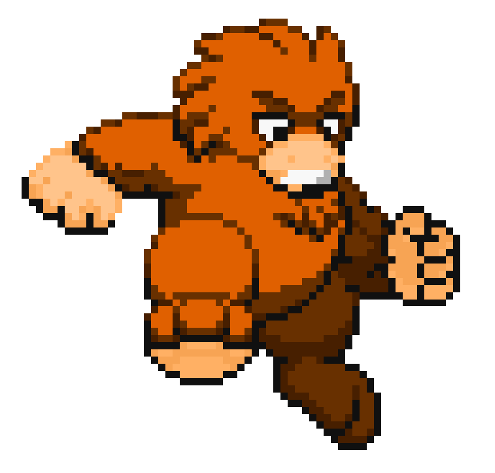

 
  

<h1 align="center"> Yeti Jam </h1>
<h3 align="center"> Godot 4.3 - Musical Video Game </h3>
<h5 align="center"> Made in less than 2 days - <a href="https://www.albigamesfestival.fr/">Albi Games Festival</a> (November 2024) </h5>

    

<!-- TABLE OF CONTENTS -->
<h2 id="table-of-contents"> :book: Table of Contents </h2>

    
Table of Contents

    <ol>
    <li><a href="#about-the-project"> ➤ About The Project</a></li>
    <li><a href="#overview"> ➤ Overview</a></li>
    <li><a href="#play"> ➤ Play the Game on the Web</a></li>
    <li><a href="#install"> ➤ How to Install Yeti Jam</a></li>
    <li><a href="#change-music"> ➤ How to Customize Musics</a></li>
    <li><a href="#credits"> ➤ Credits</a></li>
</ol>

<!-- ABOUT THE PROJECT -->
<h2 id="about-the-project"> :pencil: About The Project</h2>

 
This game was developed in under 48 hours during a game jam at a festival, with the theme rhythm. It was designed for easy adaptation to an arcade cabinet, a requirement set by <a href="https://albilab.fr/">Albilab</a>, who plans to create one for the game in the future.

<!-- OVERVIEW -->
<h2 id="overview"> :cloud: Overview</h2>

 
  This is a rhythm-based game featuring 3 levels with increasing difficulty. The objective is simple: press the correct key as the notes arrive, similar to Guitar Hero.
  The notes in the game appear based on the music timing! 

<!-- PLAY -->
<h2 id="play"> :question: Play the Game on the Web</h2>

 
You can play the game directly in your browser on itch.io. No downloads required! Simply follow the link below to start playing: <a href="https://steelpotathor.itch.io/yeti-jam">Yeti Jam</a>

<!-- INSTALL -->
<h2 id="install"> :question: How to Install the Game</h2>

Executable File (only on Windows)

<h3>Executable File</h3>

Download the game from <a href="https://github.com/SteelPotathor/Yeti-Jam/releases/tag/v1.0">releases </a> on my GitHub
repository and run the executable file.

Godot Import

<h3>Godot Import</h3>
<ol> 
<li><b>Download the project:</b> Clone or download the project from this GitHub repository.</li>
<li><b>Open Godot and Import the Project:</b> In Godot, click on the Import button (highlighted in red in the image below) to import the project into the engine.</li>
</ol>

<!-- CHANGE MUSICS -->
<h2 id="change_music"> :musical_score: Customize the music</h2>

You can modify each of the 3 levels music!

<ol>
    <li><strong>Generate the JSON</strong>: Run the <a href="https://github.com/SteelPotathor/Song-Rhythm">Python script</a> with the path to your music file (.mp3 or .wav) to create a JSON with note timings.</li>
    <pre><code>python ./Rhythm.py --audio "path/to/music.mp3" --output "path/to/output.json"</code></pre>
    <li><strong>Import into Godot</strong>: Place the JSON and audio files in your Godot project (e.g., <code>Music</code> folder).</li>
    <li><strong>Configure in Godot</strong>:
        <ul>
            <li>Open <code>Scripts/Difficulty.gd</code>.</li>
            <li>Set the JSON and audio paths in the functions as follows: use <code>on_hard_button_pressed</code> to change the hard level music, <code>on_medium_button_pressed</code> for the medium level, <code>on_easy_button_pressed</code> for the easy level.</li>
                    
</ul>
    </li>
</ol>

<!-- CREDITS -->
<h2 id="credits"> :scroll: Credits</h2>

- AlbiGamesFestival for hosting the jam
- AlbiLab for organizing the jam
- My team for their hard work (credits in-game with roles)

