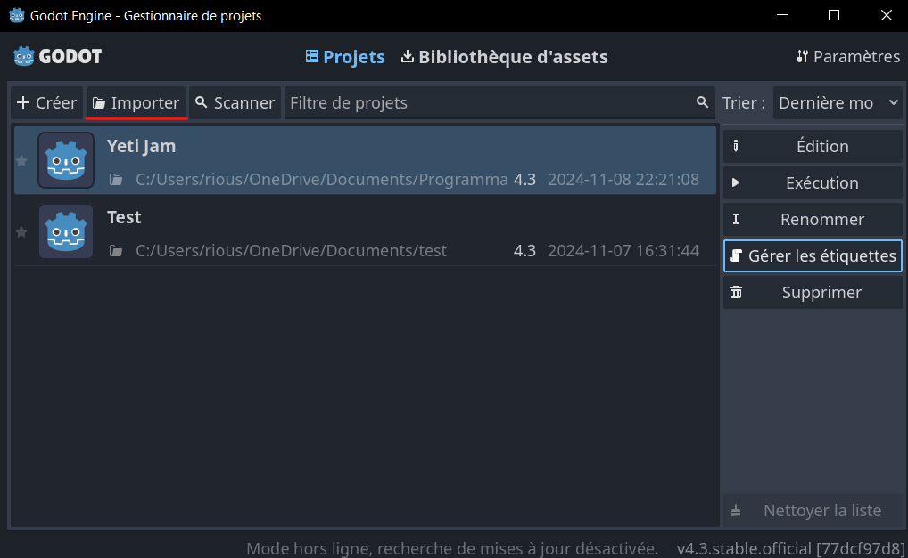
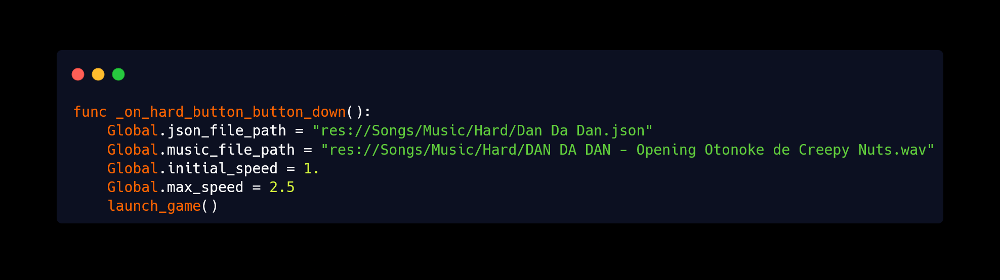

 
  

<h1 align="center"> Yeti Jam </h1>
<h3 align="center"> Godot 4.3 - Musical Video Game </h3>
<h5 align="center"> Made in less than 2 days - <a href="https://www.albigamesfestival.fr/">Albi Games Festival</a> (November 2024) </h5>

    

<!-- TABLE OF CONTENTS -->
<h2 id="table-of-contents"> :book: Table of Contents </h2>

    
Table of Contents

    <ol>
    <li><a href="#about-the-project"> ➤ About The Project</a></li>
    <li><a href="#overview"> ➤ Overview</a></li>
    <li><a href="#install"> ➤ How to install Yeti Jam</a></li>
    <li><a href="#add-your-music"> ➤ How to implement your Music</a></li>
    <li><a href="#credits"> ➤ Credits</a></li>
</ol>

<!-- ABOUT THE PROJECT -->
<h2 id="about-the-project"> :pencil: About The Project</h2>

 
This game was developed in under 48 hours during a game jam at a festival, with the theme rhythm. It was designed for easy adaptation to an arcade cabinet, a requirement set by <a href="https://albilab.fr/">Albilab</a>, who plans to create one for the game in the future.

<!-- OVERVIEW -->
<h2 id="overview"> :cloud: Overview</h2>

 
  This is a rhythm-based game featuring 3 levels with increasing difficulty. The objective is simple: press the correct key as the notes arrive, similar to Guitar Hero.

<!-- INSTALL -->
<h2 id="install"> :question: How to install the game</h2>

 
To install the game, simply download the project from my GitHub repository and import it into Godot.

<!-- ADD YOUR MUSIC -->
<h2 id="add-your-music"> :musical_score: Implement your music</h2>

 
The notes in the game appear based on the music timing. To achieve this, I created a <a href="https://github.com/SteelPotathor/Song-Rhythm">Python script</a> that generates a JSON file containing the note timings for each track. Simply input the path to the JSON and the music file (MP3 or WAV) into the Godot script <b>Scripts/Difficulty.gd</b> to customize the game for any song.

 
You can modify each of the 3 levels music! (on_hard_button_pressed = HARD, on_medium_button_pressed = MEDIUM...)

<!-- CREDITS -->
<h2 id="credits"> :scroll: Credits</h2>

AlbiGamesFestival for hosting the jam 

AlbiLab for organizing the jam 

My team for their hard work (credits in-game with roles) 

